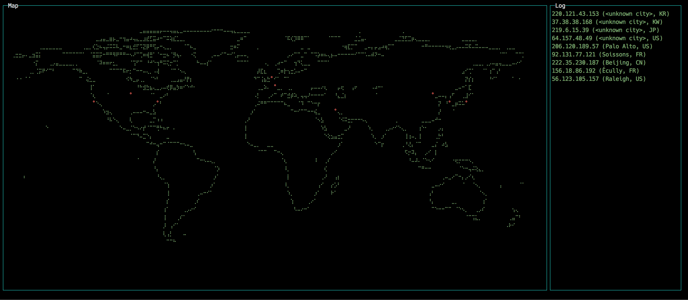

# iponmap

IpOnMap locates IP address lookup on the world map right in your terminal using awesome nodejs dashboard library [blessed-contrib](https://github.com/yaronn/blessed-contrib).

You might've seen it in the films about hackers. Now it's real with `iponmap`.


**Demo:**



[screencast demo](https://youtu.be/38YvtaQ3gRs)

## Installation
```shell
npm install -g iponmap
```

## Usage

***
```shell
$ iponmap -h

  Usage: iponmap [options] [ip...]

  Options:

    -h, --help            output usage information
    -v, --version         output the version number
    -t, --trace           trace points
    -c, --count           count uniq points
```
***

pass ips as a parameters
```shell
iponmap ip1 ip2 ip3
```
or through stdin (one ip per line)
```shell
cat iplist.txt | iponmap
```
or
```shell
iponmap < iplist.txt
```
or even
```shell
tail -f iplist.log.txt | iponmap  #draws new point on new line
```

## Arguments
`-c`,`--count`: count uniq points

`-t`, `--trace`: trace points

`-h`, `--help`: print help message

`-v`, `--version`: print version

## Examples
```shell
# show my ip on map
curl http://ipinfo.io/ip | iponmap
```

```shell
host google.com | iponmap -c
```

```shell
traceroute -n google.com | iponmap -t
```

#### Exit from application
**escape**, **q** , **Ctrl-c**

## Bugs/Issues/Feature requests
Create new issue [here](https://github.com/nogizhopaboroda/iponmap/issues)
